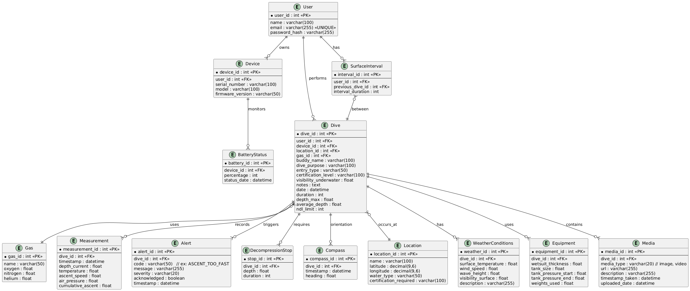
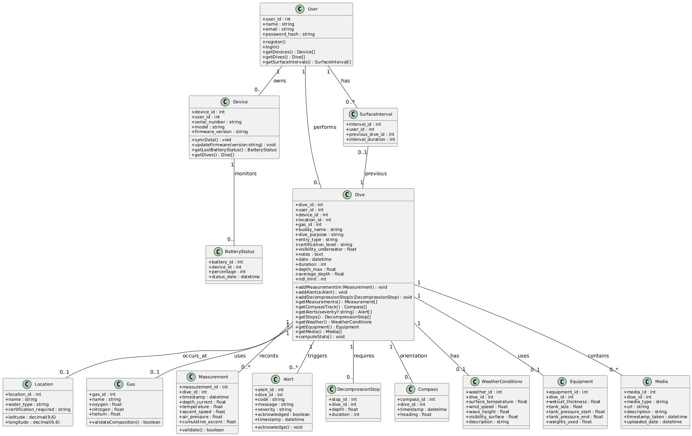
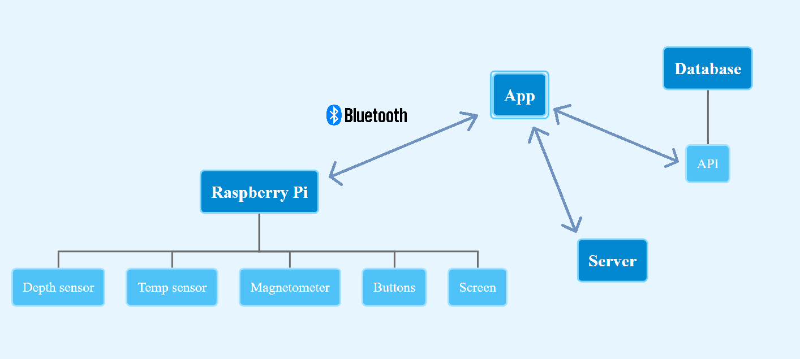
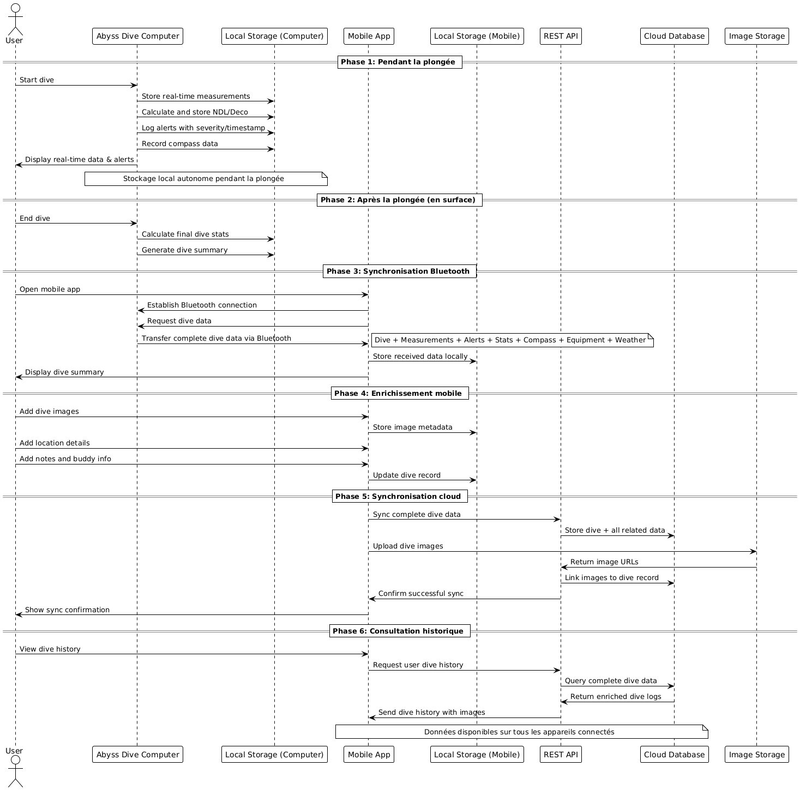

# 🌊 Abyss Diving

## Projet Abyss – Ordinateur de plongée

**Équipe :** Arno Tribolet, Nathan Füllemann, Mathéo Lopez  
**Durée :** 3 semaines  
**Objectif :** Concevoir un ordinateur de plongée permettant de plonger en toute sécurité.

---

## 📖 Documentation

### 🔹 API
- [Documentation API](./docs/API/api.md)

### 🔹 Application mobile
- [Bluetooth & synchronisation](./docs/APP/bluetooth.md)
- [Présentation de l’application](./docs/APP/readme.md)

### 🔹 Base de données
- [Description de la base de données](./docs/database/db.md)
- Diagramme entité-association :  
  
- Diagramme de classes :  
  

### 🔹 Mockups
- [Présentation des maquettes](./docs/mockup/mockup.md)
- 📱 Mockups téléphone : [mockup/phone](./docs/mockup/phone)  
- 💻 Mockups ordinateur : [mockup/computer](./docs/mockup/computer)

### 🔹 Schémas & Architecture
- [Algorithme de décompression](s./docs/algo_decompression.md)
- [Architecture générale](./docs/architecture.md)  
  
- [Choix techniques](./docs/technical_choices.md)
- Diagramme d’intégration :  
  

---

## ✨ Fonctionnalités

### 1. Mesures et affichage en temps réel
- Profondeur actuelle & maximale
- Temps de plongée écoulé
- Limite de non-décompression (NDL)
- Vitesse de remontée (alerte en cas de remontée trop rapide)
- Changement de gaz respiratoire (air, nitrox)
- Température de l’eau

### 2. Gestion de la sécurité
- Alertes visuelles et/ou sonores
- Paliers de décompression si la NDL est dépassée
- Temps de surface minimum avant plongée suivante
- Temps minimum avant de prendre l’avion

### 3. Navigation
- Compas numérique intégré

### 4. Historique et suivi
- Sauvegarde automatique des plongées
- Consultation directe sur l’ordinateur
- Synchronisation via Bluetooth avec l’application mobile

### 5. Interface et ergonomie
- Jauge de batterie
- Écran lisible sous l’eau
- Boutons utilisables avec des gants
- Menus intuitifs

### 6. Extensions (optionnel / avancé)
- **Air Integration** : mesure de la pression de la bouteille via un capteur sans fil

---

## 📚 Glossaire

- **NDL (No Decompression Limit)**: Le temps maximum qu’un plongeur peut rester à une certaine profondeur sans avoir besoin d’effectuer de paliers de décompression lors de la remontée. Un palier de sécurité est effectué à chaque plongée mais en cas d'urgence, il peut être omis. Passé ce temps NDL, la plongée passe d'une plongée récréative à une plongée technique.
  
- **Palier de décompression**: Arrêt d'une certaine durée à une certaine profondeur pendant la remontée, que le plongeur doit respecter. Dans la plongée récréative, le palier de décompression n'est pas obligatoire mais est réalisé pour éviter un accident de décompression. Il dure généralement de 3 à 5 minutes à 5 mètres de profondeur mais peut varier suivant la plongée effectuée. 
  
- **Accident de décompression**: Quand on plonge, la pression augmente et l’azote de l’air respiré se dissout dans le sang et les tissus. Lors de la remontée, si on remonte lentement, l’azote a le temps de s’éliminer progressivement par la respiration. Si on remonte trop vite ou si on dépasse la NDL sans faire les paliers, l’azote se libère brutalement et forme des bulles dans le corps.
Formes bénignes :
  - Douleurs articulaires et musculaires ("les bends").
  - Fatigue inhabituelle.
  - Démangeaisons, éruptions cutanées.
  - Formes graves :
     - Atteinte neurologique (vertiges, paralysies, troubles de la vision, perte de conscience).
     - Atteinte respiratoire (toux, essoufflement, douleur thoracique).
     - Atteinte circulatoire pouvant mener au décès.
- **Nitrox**: L'air est composé de 21% d'oxygène et 78% d'azote. Le Nitrox (aussi appelé EANx pour Enriched Air Nitrox) est un mélange respiratoire utilisé en plongée composé d’oxygène (O₂) en proportion plus élevée que l’air normal et d’azote (N₂) en proportion réduite (généralement de 32% à 40% d'oxygène). Réduire la part d’azote respiré apporte plusieurs avantages:
- Moins d’azote absorbé par le corps → donc moins de risque d’accident de décompression.
- NDL plus longues (limites de non-décompression augmentées) → on peut rester plus longtemps à une certaine profondeur qu’avec l’air.
- Moins de fatigue après la plongée (effet souvent ressenti par les plongeurs au Nitrox).
Mais il comporte aussi un désavantage majeur. En profondeur, une trop grande quantité d'oxygène devient toxic pour l'homme. C'est pour cela que chaque gaz à un MOD (Maximum Operating Depth). Plus la proportion d'oxygène est grande, plus le MOD est petit. 
- **MOD** (Maximum Operating Depth): La profondeur maximale à laquelle on peut utiliser un gaz respiratoire en toute sécurité sans risque de toxicité de l’oxygène. Quand on plonge avec de l’air ou du Nitrox, la pression partielle d’oxygène (PpO₂) augmente avec la profondeur.
Au-delà d’une certaine valeur (généralement 1,4 bar en plongée récréative, 1,6 bar en plongée technique), l’oxygène devient toxique pour le système nerveux.
Cela peut provoquer une crise hyperoxique sous l’eau → convulsions, perte de connaissance, noyade.
Le MOD définit donc une limite de profondeur à ne pas dépasser pour rester en sécurité.