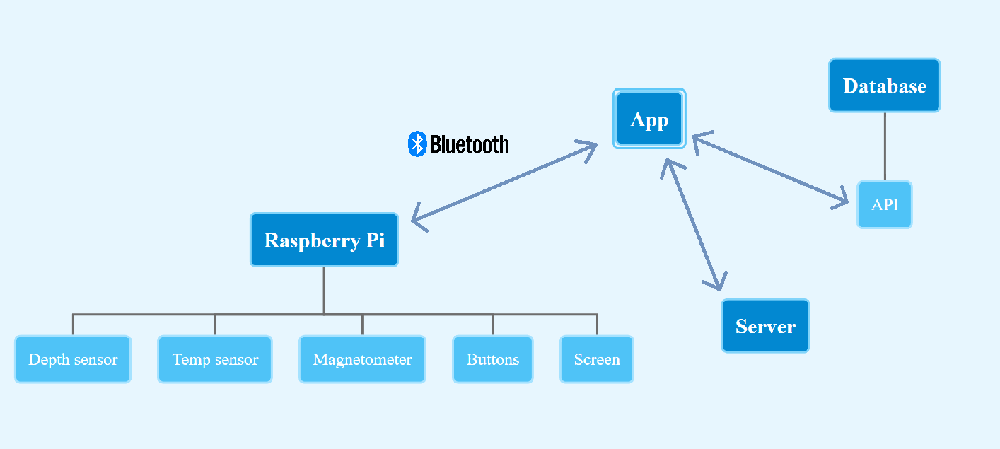

# Architecture

## Ordinateur de plongée

L'ordinateur est composé d'un Raspberry Pi et les capteurs y sont connectés. Il y aura un capteur de profondeur, de température, un magnetometre connectés en I2C au Raspberry Pi. Puis des boutons et un écran pour la navigation dans les menus et l'affichage des données.

## App

L'ordinateur peut se connecter à une application mobile via Bluetooth. Cette application permet de voir et modifier les paramètres, télécharger et afficher les logs des plongées et de vérifier s'il y a des mises à jour et les installer sur l'ordinateur.

## Server

Ce serveur est un serveur de mises à jour. Il contiendra uniquement la dernière version et les informations la concernant.

## Database

Cette base de données dans le cloud permet de se connecter avec n'importe quel appareil pour stocker et accéder aux logs des plongées.