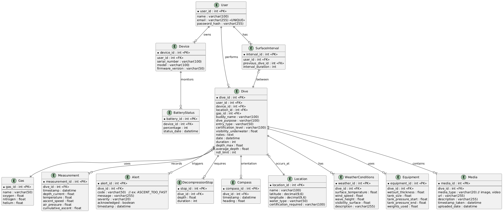

# Database
## Vue d’ensemble
- Objectif: stocker et requêter des plongées, mesures, alertes, paliers, orientation, contexte météo/équipement, médias, et état batterie des appareils.
- Acteurs principaux: User, Device, Dive; relations cardinales pensées pour l’historisation et la suppression contrôlée en cascade.

## Modèle conceptuel
- User: propriétaire logique des plongées et des appareils; pivot d’authentification/autorisation côté API.
- Device: ordinateur de plongée (Raspberry) lié à un User, avec journal batterie (BatteryStatus) et version firmware.
- Dive: entité centrale décrivant date, durée, profondeurs, NDL, entrée, binôme et liens vers Gas et Location.
- Séries temporelles: Measurement (profondeur/température/ascension/pression) et Compass (cap) forment le cœur des courbes, indexées par dive_id + timestamp.
- Sécurité: Alert codifie les événements (ex. ASCENT_TOO_FAST), sévérité et accusé de réception; DecompressionStop détaille les paliers.
- Contexte: WeatherConditions et Equipment enrichissent l’analyse post-plongée; Media référence photos/vidéos.
- SurfaceInterval: calcule/registre les temps de surface entre plongées, utile aux recommandations NDL/planning.

## Détails par table
- User
  - Clés et contraintes: email UNIQUE; password_hash stocké (hash en amont); nom requis pour identification.
  - Usages typiques: récupération de l’historique, autorisations sur Device et Dive.
- Device
  - Colonnes: serial_number, model, firmware_version; FK vers User.
  - Usages: rattacher des plongées à un matériel donné; diagnostics via BatteryStatus.
- BatteryStatus
  - Colonnes: percentage, status_date; FK device; série temporelle.
  - Usages: afficher l’état récent, anticiper la maintenance/charge.
- Dive
  - Colonnes: date, duration, depth_max, average_depth, ndl_limit; dimensionnel: buddy_name, entry_type, purpose.
  - FKs: user_id, device_id, location_id, gas_id.
  - Usages: agrégations mensuelles, statistique par site/gaz, filtrage mobile.
- Gas
  - Colonnes: name, oxygen/nitrogen/helium; intégrité via CHECK recommandé (somme ~100).
  - Usages: presets (AIR, EAN32, EAN36) et analyses liées au MOD/ppO2 côté moteur métier.
- Measurement
  - Colonnes: timestamp, depth_current, temperature, ascent_speed, air_pressure, cumulative_ascent.
  - Usages: courbes profondeur/température, contrôle vitesse de remontée.
- Alert
  - Colonnes: code, message, severity, acknowledged, timestamp.
  - Usages: tableau de bord sécurité, filtrage par sévérité et analyse post-incident.
- DecompressionStop
  - Colonnes: depth, duration; FK dive.
  - Usages: planification et preuve de respect des paliers.
- Compass
  - Colonnes: timestamp, heading (0–359).
  - Usages: reconstitution de trajectoire simple, corrélations avec mesures.
- SurfaceInterval
  - Colonnes: previous_dive_id, interval_duration; FK user.
  - Usages: calculs de sécurité entre plongées et recommandations NDL.
- Location
  - Colonnes: name, lat/long, water_type, certification_required.
  - Usages: filtres géographiques et exigences de site.
- WeatherConditions
  - Colonnes: surface_temperature, wind_speed, wave_height, visibility_surface, description.
  - Usages: contexte de plongée, corrélations conditions ↔ alertes.
- Equipment
  - Colonnes: wetsuit_thickness, tank_size, tank_pressure_start/end, weights_used.
  - Usages: consommation, confort, optimisation du lestage.
- Media
  - Colonnes: media_type, url, description, timestamp_taken, uploaded_date.
  - Usages: journal visuel et souvenirs; affichage mobile.

## Intégrité
- Gaz: oxygen + nitrogen + helium = 100; chaque composant entre 0 et 100.
- Dive: average_depth ≤ depth_max; valeurs non négatives; ndl_limit ≥ 0.
- Measurement: profondeurs et vitesses non négatives; heading dans [0,360) côté Compass.
- Alert: liste fermée de sévérités et codes validés par table de référence ou ENUM.

Portée et conventions
- Toutes les classes correspondent à des tables de la base: User, Device, BatteryStatus, Dive, Gas, Measurement, Alert, DecompressionStop, Compass, SurfaceInterval, Location, WeatherConditions, Equipment, Media.
- Les attributs reflètent les colonnes SQL (types simplifiés en types de haut niveau: string, int, float, datetime, text).
Classes principales
- User
  - Rôle: propriétaire des Appareils (Device) et des Plongées (Dive).
  - Attributs: user_id, name, email, password_hash.
  - Méthodes: register, login, getDevices, getDives, getSurfaceIntervals.
- Device
  - Rôle: ordinateur de plongée lié à un User, stocke l’historique de batterie et rattache des plongées.
  - Attributs: device_id, user_id, serial_number, model, firmware_version.
  - Méthodes: syncData, updateFirmware, getLastBatteryStatus, getDives.
- Dive
  - Rôle: entité centrale représentant une plongée et orchestrant mesures, alertes, paliers, compas et contexte.
  - Attributs: dive_id, user_id, device_id, location_id, gas_id, buddy_name, dive_purpose, entry_type, certification_level, visibility_underwater, notes, date, duration, depth_max, average_depth, ndl_limit.
  - Méthodes: addMeasurement, addAlert, addDecompressionStop, getMeasurements, getCompassTrack, getAlerts, getStops, getWeather, getEquipment, getMedia, computeStats.
- Measurement
  - Rôle: séries temporelles de profondeur/température/vitesse/pression, base des courbes et calculs de sécurité.
  - Attributs: measurement_id, dive_id, timestamp, depth_current, temperature, ascent_speed, air_pressure, cumulative_ascent.
  - Méthode: validate (cohérence des bornes physiques).
- Alert
  - Rôle: événements de sécurité (ex. ASCENT_TOO_FAST), sévérité, acknowledgment.
  - Attributs: alert_id, dive_id, code, message, severity, acknowledged, timestamp.
  - Méthode: acknowledge.
- DecompressionStop
  - Rôle: paliers de décompression (profondeur/durée) calculés et/ou respectés.
  - Attributs: stop_id, dive_id, depth, duration.
- Compass
  - Rôle: mesure du cap (heading) en série temporelle pour la trajectoire.
  - Attributs: compass_id, dive_id, timestamp, heading.
- SurfaceInterval
  - Rôle: temps de surface entre plongées pour le planning NDL et recommandations.
  - Attributs: interval_id, user_id, previous_dive_id, interval_duration.
- Location
  - Rôle: site de plongée (nom, géo, type d’eau, certifications requises).
  - Attributs: location_id, name, latitude, longitude, water_type, certification_required.
- Gas
  - Rôle: gaz respiratoire (AIR, EANx, Trimix), composants O2/N2/He.
  - Attributs: gas_id, name, oxygen, nitrogen, helium.
  - Méthode: validateComposition (somme ~100, bornes).
- WeatherConditions
  - Rôle: conditions en surface (T°, vent, houle, visibilité).
  - Attributs: weather_id, dive_id, surface_temperature, wind_speed, wave_height, visibility_surface, description.
- Equipment
  - Rôle: équipement principal (combinaison, bloc, pressions, lest).
  - Attributs: equipment_id, dive_id, wetsuit_thickness, tank_size, tank_pressure_start, tank_pressure_end, weights_used.
- Media
  - Rôle: photos/vidéos liées à la plongée, pour l’enrichissement historique.
  - Attributs: media_id, dive_id, media_type, url, description, timestamp_taken, uploaded_date.

Relations et cardinalités
- User “1” → “0..*” Device: un utilisateur possède plusieurs ordinateurs.
- Device “1” → “0..*” BatteryStatus: journal d’état de batterie par appareil.
- User “1” → “0..*” Dive: un utilisateur enregistre plusieurs plongées.
- Dive “1” → “0..1” Location et “0..1” Gas: site et gaz sont facultatifs.
- Dive “1” → “0..*” Measurement, Alert, DecompressionStop, Compass, Media: séries et événements liés à la plongée.
- Dive “1” → “0..1” WeatherConditions, “0..1” Equipment: un enregistrement contextuel unique optionnel.
- User “1” → “0..*” SurfaceInterval, et SurfaceInterval “0..1” → “1” Dive (previous): temps de surface rattaché au propriétaire et à une plongée précédente si disponible.

