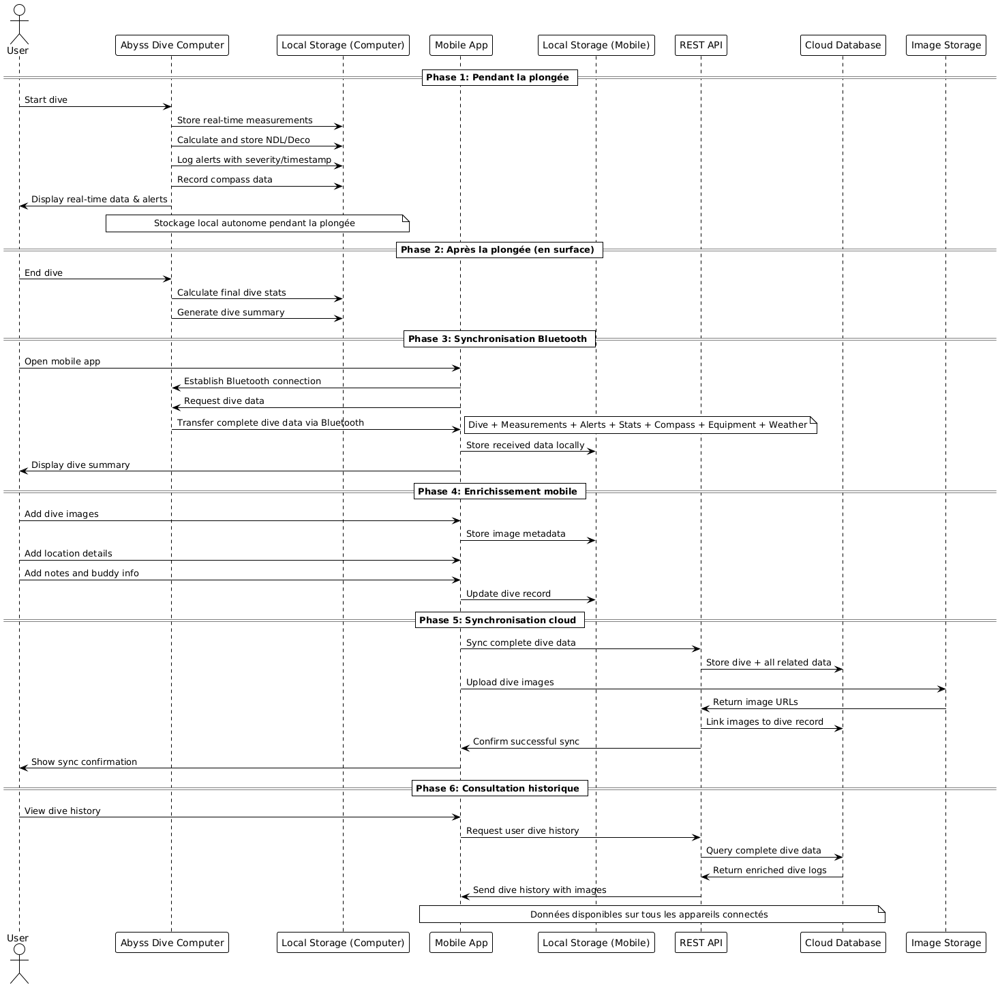

# Technical Choices

# Hardware

## Raspberry Pi

Nous avons choisi d’utiliser un Raspberry Pi Zero 2 W comme cœur de notre ordinateur de plongée. Ce choix s’explique par plusieurs raisons techniques :

- Puissance de calcul suffisante : le Raspberry Pi Zero 2 W intègre un processeur quad-core capable de gérer simultanément les calculs de décompression, l’affichage en temps réel des informations et la communication sans fil, sans risque de saturation.

- Connectivité : il dispose d’une interface Bluetooth intégrée, ce qui simplifie la synchronisation des plongées avec un smartphone et l’export des données vers l'application, sans nécessiter de module supplémentaire.

- Compatibilité logicielle : grâce à son environnement Linux, il est possible d’utiliser des bibliothèques logicielles existantes (gestion des capteurs via I²C/SPI, interface graphique, stockage des données, etc.), ce qui accélère le développement.

- Écosystème riche : le Raspberry Pi possède une documentation abondante, ce qui est utile pour le developpement rapide.

- Consommation faible : le modèle Zero 2 W a une consommation énergétique faible tout en ayant une puissance de calcul suffisante, compatible avec une alimentation sur batterie 18650, ce qui permet plusieurs heures d’autonomie.

- Compacité : son petit format permet une intégration facile dans un boîtier étanche à fixer sur le poignet du plongeur.

## Capteur de pression (profondeur)

Nous avons retenu un capteur barométrique haute précision MS5837.

- Plage de mesure adaptée : jusqu’à 30 bar selon le modèle, ce qui permet de couvrir la plongée loisir et technique (jusqu'à 290m de profondeur).

- Précision élevée : résolution de l’ordre du centimètre.

- Interface I²C : simplifie l’intégration avec le Raspberry Pi et permet d’utiliser plusieurs capteurs en parallèle si nécessaire.

- Faible consommation : adapté à une utilisation sur batterie.

- Capteur de température : le capteur MS5837 fait aussi office de thermomètre, ce qui simplifie et réduit le nombre de capteurs nécessaire.

## Batterie

Le système est alimenté par une batterie Li-ion 18650 de 3500 mAh.

- Capacité suffisante : autonomie estimée entre 3 et 5 heures selon la charge.

- Format standard : facilement remplaçable et rechargeable.

## Ecran

Nous avons choisi un écran graphique rectangulaire avec interface I²C.

- Disponibilité : l'écran a été choisi car il était disponnible au MakeLab et répondait à nos besoins.

- Lisibilité : affichage clair des données essentielles (profondeur, temps, NDL, compas).

- Compacité : format adapté pour un boîtier portable à fixer sur le poignet du plongeur.

- Faible consommation : technologie TFT basse consommation, pour préserver l’autonomie.

- Programmabilité : compatible avec des bibliothèques graphiques déjà existantes.

# Landing page
Site web Html avec tailwind pour se passer du CSS. Le site est fourni par un serveur web express nodejs simple qui le publie en ligne sur le port 3000.

# Application mobile

Nous avons choisi de développer une application mobile pour Android et iOS en **React Native**

## Technologie

* **Framework choisi** : React Native (JavaScript/TypeScript).

  * Développement cross-platform (Android + iOS).

* **Librairies principales** :

  * `react-native-ble-plx` pour la gestion du Bluetooth Low Energy (BLE).
  * `react-navigation` pour la navigation entre les écrans.
  * `redux-toolkit` ou `zustand` pour la gestion d’état global.
## Fonctionnalités principales

1. **Connexion et synchronisation**

   * Connexion Bluetooth Low Energy (BLE) avec le Raspberry Pi Zero 2 W.
   * Transfert sécurisé des données de plongée.
   * Vérification d’intégrité après transfert.

2. **Gestion des plongées**

   * Historique des plongées stocké
   * Affichage des statistiques clés :

     * profondeur max, durée totale, NDL, température, etc.
   * Graphiques interactifs (ex : courbe de profondeur, température).

3. **Enrichissement des plongées**

   * Ajout de photos, notes, localisation GPS.
   * Gestion des informations du binôme et de l’équipement.

4. **Synchronisation cloud**

   * API REST (backend Node.js/Express) communiquant avec PostgreSQL.
   * Upload des plongées et des photos.
   * Multi-device : accès aux plongées depuis n’importe quel smartphone connecté.

## Architecture logicielle

* **Pattern MVVM** (Model – View – ViewModel) pour séparer la logique et l’affichage.
* **Sécurité** :
  * Connexion chiffrée BLE.
  * Communication HTTPS avec le cloud.
  * Authentification JWT (token) pour la V2.

# Base de données
Base de donnée choisis PostgressSQL car simple à prendre en main. Elle prend en compte les champs JSON/JSONB ce qui nous permet d’avoir des champs semi-structurés si besoin (par exemple pour stocker des données capteurs).
# Cloud
Il nous faut un hébergement cloud containerisé car facile à déployer, scalable, pas besoin de gérer l’infrastructure lourde et en plus permet d’accéder partout aux plongées enregistrées et synchroniser avec l’appli mobile.
# Interaction entre les différents composants

Description détaillée du flux de données
## Phase 1 : Stockage local pendant la plongée
L'ordinateur Abyss fonctionne de manière totalement autonome :
- Enregistrement des mesures en temps réel dans sa mémoire locale
- Calculs des statistiques de sécurité (NDL, décompression)
- Logging de toutes les alertes avec leur niveau de gravité
- Aucune dépendance réseau ou Bluetooth pendant la plongée

## Phase 2 : Calcul des statistiques finales
À la fin de la plongée, l'ordinateur :

- Calcule les statistiques complètes (profondeur moyenne, consommation d'air, etc.)
- Génère le résumé de plongée avec tous les événements
- Prépare les données pour la synchronisation

## Phase 3 : Synchronisation Bluetooth
Le plongeur connecte son téléphone à l'ordinateur :

- Connexion automatique via Bluetooth quand l'app mobile s'ouvre
- Transfer complet de toutes les données de plongée
- Vérification d'intégrité des données transférées
- Stockage local sur le téléphone pour consultation hors-ligne

## Phase 4 : Enrichissement via l'application mobile
Le plongeur peut enrichir ses données :

- Ajout de photos prises pendant ou après la plongée
- Saisie d'informations contextuelles (lieu exact, conditions)
- Ajout de notes personnelles et informations sur le binôme
- Saisie des détails d'équipement utilisé

## Phase 5 : Synchronisation cloud
L'application mobile synchronise avec le cloud :

- Stockage des images dans un service de stockage dédié
- Sauvegarde complète de l'historique de plongée
- Synchronisation multi-appareils possible

# Workflow
